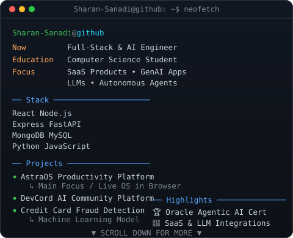
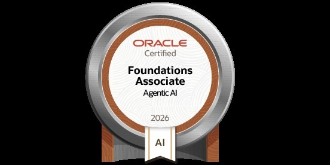
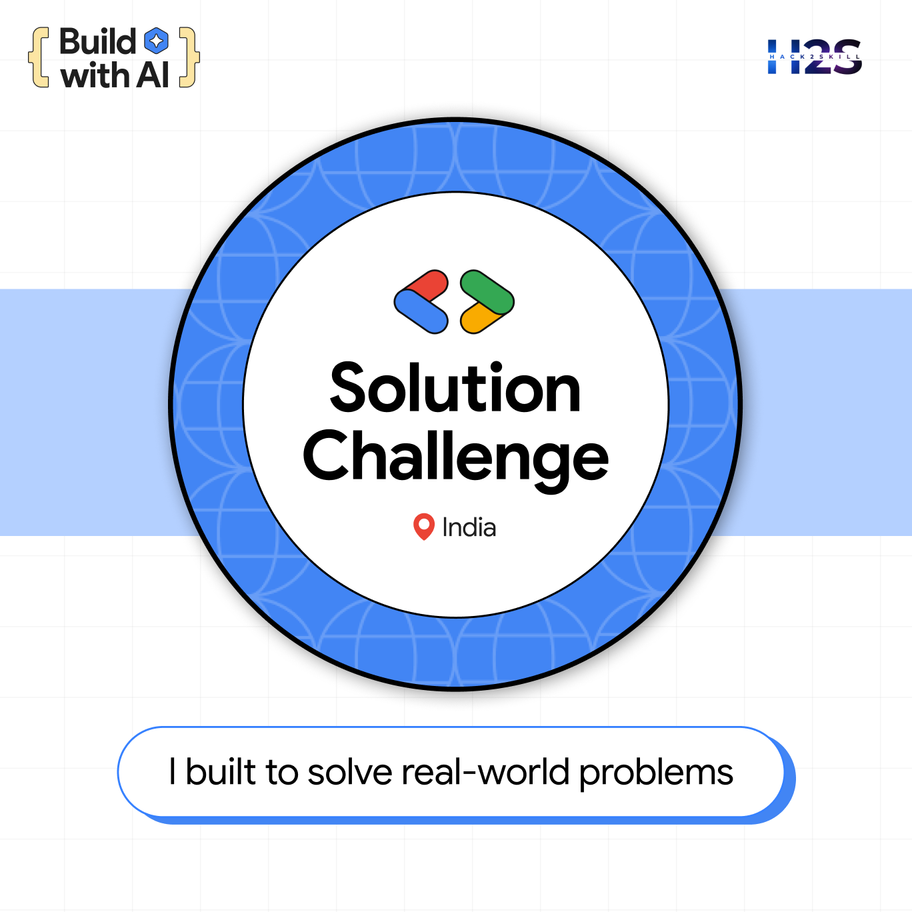

<div align="center">
<table>
<tr>
<td valign="top">

</td>
<td valign="top">

</td>
</tr>
</table>

# Sharan Sanadi

<p align="center">
  <a href="https://readme-typing-svg.demolab.com"></a>
</p>

<p align="center">
  <a href="https://www.linkedin.com/in/sharan-sanadi-7b32701b0/" target="_blank">
    
  </a>
  <a href="mailto:sharansanadi2006@gmail.com" target="_blank">
    
  </a>
  <a href="https://github.com/Sharan-Sanadi" target="_blank">
    
  </a>
  &nbsp;
  
</p>

<br/>

## 🧠 Who I Am

</div>

<table>
<tr>
<td>

I am a Computer Science student, Full-Stack Developer, and AI/ML Engineer specializing in building scalable web applications, developing machine learning models, and integrating AI/LLMs. I focus on clean architectures, modern development workflows, and writing performant, secure code.

* **Education:** Computer Science Student

</td>
</tr>
</table>

<div align="center">

---

## 🔨 What I'm Building Right Now

### AstraOS — SaaS Productivity Platform as a Browser OS

</div>

<table>
<tr>
<td>

> A production-grade, AI-powered personal productivity platform reimagined as a desktop OS in the browser.

</td>
</tr>
</table>

<div align="center">

```
User Login (Vite/React)
    ↓
Command Center Dashboard (Desktop OS UI)
    ↓
AYNTK AI Copilot (OpenRouter APIs) ──→ Context-Aware Recommendations
    ↓
AI Vault Space (Cloudinary Signed Tokens) ──→ Secure Media Storage
    ↓
Database (MongoDB Mongoose 9) ──→ User Catalog & State Management
```

</div>

<table>
<tr>
<td>

**Key Features & Implementation:**
- **AYNTK AI Copilot:** Context-aware AI assistant utilizing OpenRouter with configurable models and token/timeout limits.
- **Command Center Dashboard:** Desktop-style task board with focus windows and widgets.
- **AI Vault Space:** Secure media storage using Cloudinary signed tokens and MongoDB catalog.

**Tech Stack:** React 19, TypeScript, Node.js (Express), MongoDB (Mongoose 9), Vite, Cloudinary, OpenRouter API.

**Links:** [Live Demo](https://astra-os-phi.vercel.app/) • [GitHub Repo](https://github.com/Sharan-Sanadi/ASTRA-OS)

</td>
</tr>
</table>

<div align="center">

---

## 🚀 Featured Projects

<table>
  <tr>
    <td width="50%" valign="top">
      <h3>🧠 <a href="https://github.com/Sharan-Sanadi/ASTRA-OS">AstraOS</a></h3>
      
      
      <br/><br/>
      A production-grade, AI-powered personal productivity platform reimagined as a desktop OS in the browser. Features context-aware AI copilot and secure file vaults.
      <br/><br/>
      
      
      
    </td>
    <td width="50%" valign="top">
      <h3>🤖 <a href="https://dev-cord-client.vercel.app">DevCord AI</a></h3>
      
      
      <br/><br/>
      An intelligent developer community platform integrating AI for code reviews, interactive debugging, smart searching, and collaboration.
      <br/><br/>
      
      
      
    </td>
  </tr>
    <tr>
      <td width="50%" valign="top">
        <h3>💳 <a href="https://github.com/Sharan-Sanadi/Credit-Card-Fraud-Detection">Credit Card Fraud Detection</a></h3>
        
        
        <br/><br/>
        An end-to-end Machine Learning project to detect fraudulent credit card transactions, using robust validation strategies and pipeline design to handle extreme class imbalance.
        <br/><br/>
        
        
        
      </td>
      <td width="50%" valign="top">
        <h3>🏥 <a href="https://github.com/Sharan-Sanadi/Medical-Insurance-Cost-Prediction">Medical Insurance Cost Prediction</a></h3>
        
        
        <br/><br/>
        A predictive machine learning project utilizing Regression models to estimate medical insurance costs based on physical, lifestyle, and demographic attributes.
        <br/><br/>
        
        
        
      </td>
    </tr>
</table>

---

## 🛠️ Technical Toolkit


<br/>

| Area | Tools |
|---|---|
| **💻 Programming Languages** | C • C++ • Java • Python • JavaScript |
| **🌐 Frontend Technologies** | React • HTML5 • CSS3 • Tailwind CSS • Vite |
| **⚙️ Backend & AI Frameworks** | Node.js • Express.js • FastAPI • Streamlit • scikit-learn • NumPy • Pandas • Matplotlib • Seaborn |
| **🗄️ Database & DevOps / Cloud** | MongoDB • MySQL • Git • GitHub • Docker • Vercel • Render |

---

## 🏆 Certifications & Badges

<table align="center" border="0" cellpadding="16">
  <tr>
    <td align="center" valign="middle">
      <br/><br/>
      
    </td>
    <td align="center" valign="middle">
      <a href="assets/build-with-ai-certificate.pdf" target="_blank">
        <br/><br/>
      </a>
      
    </td>
  </tr>
</table>

<br/>

### 🎓 Oracle Agentic AI Foundations Associate (2026)

</div>

<table>
<tr>
<td>

> Focused on fundamentals of Agentic AI systems, autonomous agents, and real-world AI applications.

</td>
</tr>
</table>

<div align="center">

| Core Areas | Key Concepts |
|---|---|
| 🤖 **Agentic AI Systems** | Architecture of autonomous agents, reasoning loops, and planning methodologies |
| 🧠 **Autonomous Agents** | Design patterns for self-directed AI tools, task decomposition, and memory systems |
| 💼 **Real-World Applications** | Integration of agents with tools, external APIs, and business automation workflows |

<br/>

### 🛠️ Google Solution Challenge 2026: Build with AI

</div>

<table>
<tr>
<td>

> Awarded for successful prototype submission in the Solution Challenge 2026: Build with AI, recognizing autonomous agent design, API integration, and collaborative problem-solving.

</td>
</tr>
</table>

<div align="center">

---

## 📊 GitHub Insights

<table>
<tr>
<td>

</td>
<td>

</td>
</tr>
</table>

### 📈 Contribution Graph

<picture>
  <source media="(prefers-color-scheme: dark)" srcset="https://github-readme-activity-graph.vercel.app/graph?username=Sharan-Sanadi&theme=react-dark&custom_title=Sharan%20Sanadi" />
  <source media="(prefers-color-scheme: light)" srcset="https://github-readme-activity-graph.vercel.app/graph?username=Sharan-Sanadi&theme=react&custom_title=Sharan%20Sanadi" />
  
</picture>

---

## ⚡ Beyond Coding

</div>

<table>
<tr>
<td>

- 💬 Ask me about: **Web Development, AI/ML models, AI agent integration, and Clean Architecture**
- 🌱 Open Source: Contributed features and bug fixes to established community repositories.
- 🚀 Goals: Aiming to design and deploy highly secure, modern SaaS products.

</td>
</tr>
</table>

<div align="center">

---

## 🤝 Let's Talk

If you're building something where clean code and system design matter, let's connect.

<a href="https://www.linkedin.com/in/sharan-sanadi-7b32701b0" target="_blank">
  
</a>

<br/><br/>

> I debug for fun. That's either a green flag or a red flag depending on your team culture.


</div>
